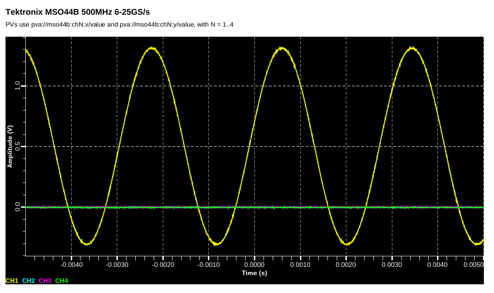
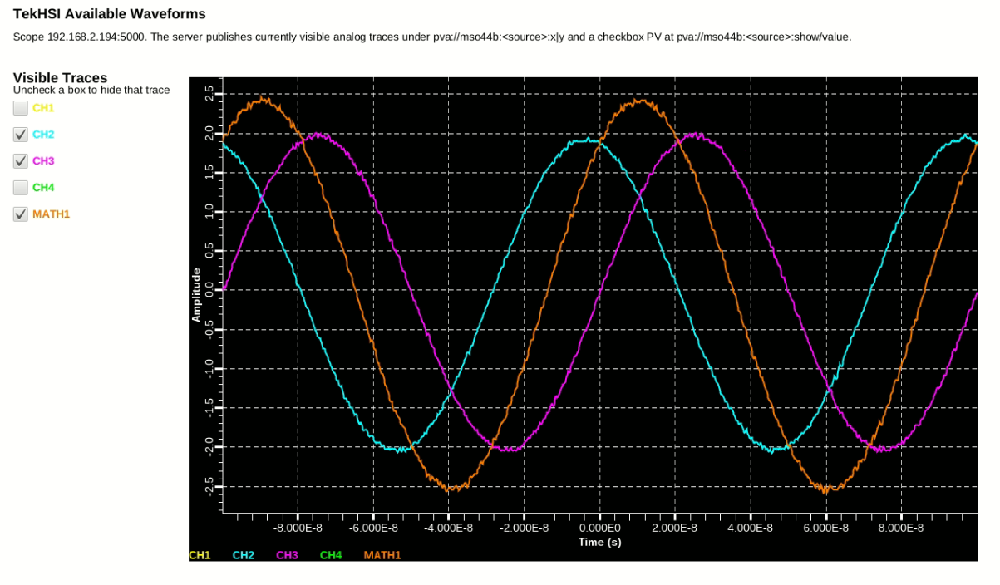

# EPICS PVA / P4P Interface

This folder contains small `TekHSI` examples that publish scope waveforms through an EPICS PVA
server built with [`p4p`](https://epics-base.github.io/p4p/overview.html#overviewpva).

The folder is organized by example, not by file type. That keeps each Python server next to the
Phoebus display that belongs to it, which is usually the easiest structure to maintain as the
examples evolve.



## Folder Layout

1. [`single_channel/`](single_channel/)
   One waveform acquisition example with its Python server and matching X-Y plot display
2. [`four_channel/`](four_channel/)
   Four-waveform synchronized acquisition example with its Python server and matching X-Y plot
   display
3. [`math_channel/`](math_channel/)
   Discovery helpers plus a dynamic visible-waveform P4P example with a generated Phoebus client
4. [`figs/`](figs/)
   Screenshots used by this README

## Requirements

1. A supported Tektronix scope with the High Speed Interface enabled
2. A 64-bit Python installation
3. `TekHSI`
4. `p4p`
5. Phoebus, if you want to open the `.bob` displays

`PyVISA` is not required for this workflow.

## Installation

```shell
python3 -m venv .venv
source .venv/bin/activate
python -m pip install tekhsi p4p
```

## Single-Channel Example

Files:

1. [`single_channel/analog_waveform_server.py`](single_channel/analog_waveform_server.py)
2. [`single_channel/analog_waveform_xyplot_client.bob`](single_channel/analog_waveform_xyplot_client.bob)

The single-channel server publishes:

1. `mso44b:x`
2. `mso44b:y`

The corresponding Phoebus display reads:

1. `pva://mso44b:x/value`
2. `pva://mso44b:y/value`

Run it from the repository root with:

```shell
python3 p4p_interface/single_channel/analog_waveform_server.py
```

## Four-Channel Example

Files:

1. [`four_channel/analog_waveform_server.py`](four_channel/analog_waveform_server.py)
2. [`four_channel/analog_waveform_xyplot_client.bob`](four_channel/analog_waveform_xyplot_client.bob)

The four-channel server reads `ch1`, `ch2`, `ch3`, and `ch4` inside one `access_data()` block so
all four traces come from the same acquisition.

It publishes:

1. `mso44b:ch1:x` and `mso44b:ch1:y`
2. `mso44b:ch2:x` and `mso44b:ch2:y`
3. `mso44b:ch3:x` and `mso44b:ch3:y`
4. `mso44b:ch4:x` and `mso44b:ch4:y`

The corresponding Phoebus display overlays the four traces on the same X-Y plot.

Run it from the repository root with:

```shell
python3 p4p_interface/four_channel/analog_waveform_server.py
```

## Math Channel Example



Files:

1. [`math_channel/list_available_names.py`](math_channel/list_available_names.py)
2. [`math_channel/inspect_math_fft_sources.py`](math_channel/inspect_math_fft_sources.py)
3. [`math_channel/run_available_waveforms.sh`](math_channel/run_available_waveforms.sh)
4. [`math_channel/tekhsi_utils.py`](math_channel/tekhsi_utils.py)
5. [`math_channel/publish_available_waveforms_server.py`](math_channel/publish_available_waveforms_server.py)
6. [`math_channel/generate_available_waveform_xyplot_client.py`](math_channel/generate_available_waveform_xyplot_client.py)
7. [`math_channel/available_waveform_xyplot_client.bob`](math_channel/available_waveform_xyplot_client.bob)

The helpers in this folder print the source names currently exposed by the TekHSI server and group them into
`channels`, `math`, `measurements`, `iq`, and `other`.

[`tekhsi_utils.py`](math_channel/tekhsi_utils.py) centralizes the reusable TekHSI discovery and
acquisition helpers so the example scripts do not duplicate connection logic. In particular, it
includes:

1. `available_names()` for raw TekHSI discovery
2. `available_xy_source_names()` for sources that can be published on the shared XY plot
3. `waveform_to_xy_arrays()` for converting both `AnalogWaveform` and `IQWaveform` objects into
   plain `x/y` arrays

Run it from the repository root with:

```shell
source .venv/bin/activate
python p4p_interface/math_channel/list_available_names.py --address 192.168.2.194:5000
```

To check whether a math trace or FFT is exposed under names such as `math2` or `ch2_iq`, run:

```shell
source .venv/bin/activate
python p4p_interface/math_channel/inspect_math_fft_sources.py --address 192.168.2.194:5000
```

To publish the currently visible channels, math traces, and any available IQ/spectrum sources such
as `ch2_iq`, and expose a writable `show` PV per source, run:

```shell
source .venv/bin/activate
python p4p_interface/math_channel/publish_available_waveforms_server.py
```

To generate a Phoebus `.bob` client with one checkbox per discovered source, run:

```shell
source .venv/bin/activate
python p4p_interface/math_channel/generate_available_waveform_xyplot_client.py
```

To run the most common sequence in one step, use:

```shell
bash p4p_interface/math_channel/run_available_waveforms.sh
```

The launcher script activates `.venv`, lists the currently available TekHSI sources, regenerates the
Phoebus display, and then starts the P4P server in the foreground.

The generated display writes to `pva://mso44b:<source>:show/value`. The server reacts by publishing
empty arrays for hidden traces, so the plot updates without Phoebus rules. IQ sources are projected
into a simple frequency-domain magnitude spectrum so they can be published through the same `x/y`
PV structure as analog and math traces.

The generated Phoebus interface uses two stacked plots:

1. top plot for `*_iq` sources with frequency on the x axis and dB on the y axis
2. bottom plot for analog and math waveforms with time on the x axis and volts on the y axis

If you change which traces are visible on the scope, regenerate the `.bob` file and restart the
server so the published source set matches the new scope state.

## Configuration

Each example keeps its own configuration constants at the top of the server script.

For the single-channel example:

```python
SCOPE_ADDRESS = "192.168.2.194:5000"
SOURCE_NAME = "ch1"
PV_PREFIX = "mso44b"
```

For the four-channel example:

```python
SCOPE_ADDRESS = "192.168.2.194:5000"
SOURCE_NAMES = ("ch1", "ch2", "ch3", "ch4")
PV_PREFIX = "mso44b"
```

If you change `PV_PREFIX`, update the matching `.bob` file in the same example folder.

## Core

```python
with TekHSIConnect(address) as connection:
    source_names = available_names(address)
    connection.active_symbols(source_names)
    connection.force_sequence()

    while True:
        with connection.access_data(AcqWaitOn.NewData):
            waveforms = {
                name: connection.get_data(name)
                for name in source_names
            }

```


## Why This Layout

Organizing by `single_channel` and `four_channel` is usually a better habit than splitting into
`python/` and `css_boy/` folders here because:

1. Each example is self-contained and easier to copy, test, and explain
2. The Python server and the `.bob` file change together, so keeping them together reduces drift
3. Adding a new example later, such as `spectral/` or `digital/`, stays straightforward

## Related Documentation

1. [`TekHSI` main README](../README.md)
2. [`p4p` overview](https://epics-base.github.io/p4p/overview.html#overviewpva)
3. [TekHSI documentation](https://tekhsi.readthedocs.io)
